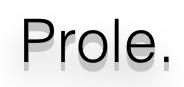

# ❌ This project is no longer actively maintained ❌

[live demo](https://prole-aus.org) | [get the chrome extension](https://prole-aus.org) | [feedback](https://prole-aus.org)

Prole is a Chrome browser extension that checks for political endorsements 🇦🇺

Prole will tell you whether a news website has endorsed a political party during a recent Australian election.

## Motivation
Prole seeks to help readers understand unseen political bias in their
content by displaying publicly available information about the authoring
entity.
